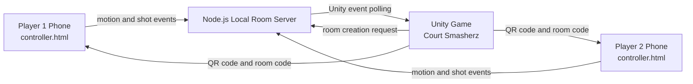

# Court Smasherz

Court Smasherz is an Apollo 11 Orbital project that recreates the fun of pickleball as a portable local multiplayer video game. The laptop runs the Unity game, while each player uses a mobile phone as a motion-controlled racquet through gyroscope and accelerometer input.

## Team

Team name: Court Smasherz

Proposed level of achievement: Apollo 11

Team members:

- Kang Kiat Yang
- Kumar Rakesh Aswani

## One-Sentence Summary

Court Smasherz is a two-player pickleball game where players swing their phones like racquets to play on a shared laptop screen.

## Project Overview

Court Smasherz is a local multiplayer pickleball game designed to be played anywhere with only a laptop and two mobile phones. The laptop displays a 3D Unity pickleball match, while the phones act as racquets. Each phone sends motion data to the laptop through a local room server, and the game interprets that data as racquet movement and shot events.

The game follows a Wii Tennis-inspired format. Each player sees the court from their own half of a vertical split-screen view. Characters move automatically toward the ball, so players can focus on timing their phone swings. The system detects different shot types such as forehand, backhand, lob, and smash based on phone movement.

## Motivation

The motivation behind Court Smasherz is to create a fun, accessible, and active pickleball experience using devices that most people already have: a mobile phone and a laptop.

There are times when students want to play a quick game during long breaks between lessons, but physical pickleball requires space, equipment, and a suitable court. Consoles such as the Wii or Nintendo Switch provide motion-based sports games, but not everyone owns or carries them around.

Pickleball has also become increasingly popular in Singapore. However, physical pickleball can be noisy, and some residential areas have restricted late-night play due to complaints. Court Smasherz aims to provide a quieter virtual alternative that still captures the fast-paced and adrenaline-inducing feeling of pickleball.

The goal is to make pickleball more portable and accessible for students, working adults, and even players who may prefer or require an upper-body-focused sports experience.

## Aim

We aim to build a multiplayer pickleball video game that allows users to control a virtual racquet using their mobile phone's inertial measurement unit, including the gyroscope and accelerometer.

The intended experience is:

- Easy to set up with only a laptop and phones.
- Playable in small indoor spaces.
- Suitable for short breaks between classes or meetings.
- Motion-controlled enough to feel physical and engaging.
- Accessible to a wider audience than physical pickleball.

## User Stories

- As a student who wants to have fun between lessons, I want to play a few rounds of pickleball without buying a Wii, Nintendo Switch, or physical pickleball equipment.
- As a working adult who wants to de-stress during work breaks or between meetings, I want a quick and portable pickleball game that does not require bringing a console around.
- As someone in a wheelchair who wants to play sports using my upper body, I want to play a virtual game of pickleball anytime so that I can still enjoy an active lifestyle.

## Core Features

| No. | Core Feature | Description | Current Status |
| --- | --- | --- | --- |
| 1 | Phone motion controls for racquet swing | Uses the phone gyroscope and accelerometer to detect swings, tilt, and direction, then maps them to in-game racquet motion. | Implemented |
| 2 | Ball physics engine | Simulates ball movement, speed, bounce, trajectory, and collision with the racquet and court. | Implemented |
| 3 | Automatic player movement | The in-game character moves toward the ball automatically so players only focus on timing and swinging. | Implemented |
| 4 | Shot detection and shot variation | Different phone motions produce shot types such as forehand, backhand, lob, and smash. | Implemented |
| 5 | Scoring and match system | Tracks points, win condition, match end, and restart flow. | Implemented |
| 6 | Local multiplayer mode | Allows two players to connect phones to the same laptop and play in the same local game session. | Implemented |
| 7 | Calibration system | Lets users set a neutral phone position so racquet controls feel more accurate. | Implemented |

## Extension Features

These are planned only after the Apollo core features are stable:

| No. | Extension Feature | Description |
| --- | --- | --- |
| 1 | Difficulty levels / AI opponent | Add AI opponents with different difficulty settings by adjusting ball speed, reaction time, and shot accuracy. |
| 2 | Sound effects and visual feedback | Add hit sounds, bounce sounds, swing trails, and impact animations. |
| 3 | Special shots / energy mechanic | Add power shots or an energy/stamina bar to make gameplay more exciting. |
| 4 | Different game modes | Add other sports or variants such as table tennis, badminton, tennis, or 2v2. |

## Current Implemented Prototype

The current prototype includes:

- Unity 3D pickleball court with net, lines, ball, and player avatars.
- Wii Tennis-style vertical split-screen view.
- Behind-player third-person cameras.
- Sci-fi styled start screen.
- QR-code room join screen.
- Two-player phone controller flow.
- Swing-to-start readiness gate.
- Phone motion racquet control.
- Motion-based swing detection.
- Forehand, backhand, lob, and smash shot events.
- Automatic player movement.
- Simplified scoring and win-by-two match end.
- Restart flow after match end.
- Fallback phone shot buttons for debugging.
- Automated tests for motion classification, rooms, and scoring.

## Gameplay Flow

1. The laptop opens the Unity game.
2. The player clicks `Press to Play!`.
3. The QR-code menu appears.
4. Player 1 and Player 2 scan the QR code or open the phone controller URL.
5. Each phone chooses either Player 1 or Player 2.
6. Each phone joins the same room.
7. Each player enables phone motion sensors and calibrates their phone.
8. The laptop player presses Start.
9. Both players swing once to confirm that motion input is working.
10. The match begins.
11. Characters move automatically toward the ball.
12. Players swing their phones when the ball reaches their racquet.
13. The match ends when a player reaches the win condition.
14. Pressing `R` returns the game to the swing-to-start readiness screen.

## Tech Stack

The project uses:

- Unity Game Engine for the 3D game.
- C# for Unity gameplay logic.
- Unity Input System for keyboard/debug input.
- WebSockets for phone-to-server communication.
- Node.js for the local room server.
- Browser DeviceMotionEvent and DeviceOrientationEvent for phone motion input.
- JavaScript shared modules for motion classification and scoring tests.
- GitHub for version control and collaboration.
- Blender as a planned tool for future asset creation.

## Architecture



The server handles:

- Room creation.
- Player slot joining.
- WebSocket relay for browser clients.
- Unity event polling endpoints.
- Temporary in-memory match/session events.

No database is used because the current game state is temporary and session-based.

## Repository Structure

```text
NUS_Orbital_2026/
├── Assets/CourtSmasherz/
│   ├── Editor/
│   │   └── CourtSmasherzSceneBuilder.cs
│   ├── Scenes/
│   │   └── CourtSmasherz3D_Generated.unity
│   └── Scripts/
│       ├── CourtSmasherzGameManager.cs
│       ├── PhoneMotionHttpBridge.cs
│       ├── MainMenuController.cs
│       ├── StartScreenController.cs
│       ├── SplitScreenFollowCamera.cs
│       └── PickleballRacquetController.cs
├── client/
│   ├── controller.html
│   ├── game.html
│   └── src/
│       ├── controller.js
│       ├── game.js
│       └── socket.js
├── server/
│   ├── index.js
│   └── rooms.js
├── shared/
│   ├── motion.js
│   └── scoring.js
├── tests/
│   ├── motion.test.js
│   ├── rooms.test.js
│   └── scoring.test.js
└── package.json
```

## How To Run The Game

This is the player/customer flow. Players should not need to open Unity to play the game.

### Customer Requirements

- Windows laptop.
- Node.js installed, unless the distributed build includes a bundled Node executable.
- Two phones on the same Wi-Fi network as the laptop.
- Chrome on Android is recommended for phone testing.

### 1. Install Node.js

The game uses a small local Node.js server so phones can connect to the laptop.

If the game zip does not include a bundled Node executable, install Node.js before launching the game:

1. Open the official Node.js download page:

```text
https://nodejs.org/en/download
```

2. Download the Windows Installer for the LTS version.
3. Run the installer.
4. Keep the default options selected, including `npm package manager` and `Add to PATH`.
5. Finish the installation.
6. Open Command Prompt or PowerShell and check:

```powershell
node -v
npm -v
```

If both commands print version numbers, Node.js is installed correctly.

### 2. Download And Extract The Game

Download the released game zip file and extract it.

The extracted folder should contain the Windows game executable and the files needed by Unity, for example:

```text
Court Smasherz/
├── Court Smasherz.exe
├── Court Smasherz_Data/
├── UnityPlayer.dll
├── server/
├── client/
└── shared/
```

Keep these files and folders together. Do not move only the `.exe` out of the folder.

### 3. Launch The Game

Double-click:

```text
Court Smasherz.exe
```

If Windows Defender appears, click `More info`, then `Run anyway`.

The game executable will try to start the local phone-controller server automatically.

### 4. Join With Phones

On the laptop:

1. Click `Press to Play!`.
2. Wait for the QR code and room code to appear.
3. Ask Player 1 and Player 2 to scan the QR code.
4. Press Start after both phones have joined.
5. Wait for both players to swing once.
6. Play the match.

On each phone:

1. Scan the QR code shown on the laptop.
2. Choose Player 1 or Player 2.
3. Tap `Join room`.
4. Tap `Enable motion sensors`.
5. Move the phone and check that motion values update.
6. Tap `Calibrate neutral paddle`.
7. Swing once when the laptop asks both players to get ready.
8. During gameplay, swing the phone when the ball reaches your racquet.

### 5. Phone URL Fallback

If the QR code does not scan, manually open the phone controller URL shown on the laptop. It should look like:

```text
http://<laptop-LAN-IP>:3000/controller.html
```

Example:

```text
http://192.168.0.13:3000/controller.html
```

## Developer Setup

Use this section only if you want to edit or rebuild the project.

### Developer Requirements

- Unity installed.
- Node.js installed from `https://nodejs.org/en/download`, or access to the bundled Node executable used during development.
- Two phones on the same Wi-Fi network as the laptop.
- Chrome on Android is recommended for phone testing.

### 1. Open The Unity Project

Open the project folder in Unity:

```text
NUS_Orbital_2026
```

Wait for Unity to finish compiling.

### 2. Build Or Open The Scene

In the Unity menu, click:

```text
Court Smasherz > Build 3D Prototype Scene
```

This creates:

```text
Assets/CourtSmasherz/Scenes/CourtSmasherz3D_Generated.unity
```

Open the generated scene and press Play.

### 3. Optional Manual Server Start

The Unity game can start the local server automatically when `Auto Start Local Server` is enabled on `PhoneMotionHttpBridge`.

If you want to start the server manually from the project root, run:

```powershell
npm start
```

or:

```powershell
node server/index.js
```

During development, this direct command was also used:

```powershell
& "C:\Users\kumar\.cache\codex-runtimes\codex-primary-runtime\dependencies\node\bin\node.exe" server/index.js
```

The local server runs on:

```text
http://localhost:3000
```

The phone controller is opened through the laptop LAN IP:

```text
http://<laptop-LAN-IP>:3000/controller.html
```

Example:

```text
http://192.168.0.13:3000/controller.html
```

## Playtesting Instructions

### Laptop

1. Extract the game zip.
2. Double-click `Court Smasherz.exe`.
3. Click `Press to Play!`.
4. Wait for the QR code and room code to appear.
5. Ask both phone players to join the room.
6. Press Start after both players are ready.
7. Wait for both players to swing once.
8. Play the match.

### Phone

1. Scan the QR code or open the displayed phone URL.
2. Select Player 1 or Player 2.
3. Tap `Join room`.
4. Tap `Enable motion sensors`.
5. Move the phone and check that motion values update.
6. Tap `Calibrate neutral paddle`.
7. Swing once when the laptop asks both players to get ready.
8. During gameplay, swing the phone when the ball reaches your racquet.

## Controls

Phone motion is the intended control method.

- Sideways swing: forehand or backhand.
- Upward motion: lob.
- Strong downward/forward swing: smash.
- Phone tilt and rotation: racquet/arm movement.

Debug keyboard controls are disabled by default. To enable them, select the Game Manager in Unity and turn on `Enable Keyboard Test Shots`.

| Player | Forehand | Backhand | Lob | Smash |
| --- | --- | --- | --- | --- |
| P1 | A | S | D | F |
| P2 | J | K | L | ; |

After a match ends, press `R` to return to the swing-to-start readiness screen.

## Game Rules

The current version uses a simplified pickleball match system:

- Each player controls one side of the court.
- Characters move automatically toward the ball.
- A swing only hits the ball if the ball is close enough to the racquet.
- Mistimed swings miss.
- If the ball is not returned, the other player scores.
- The match ends when a player reaches the target score with the required margin.

## Timeline

### Core Timeline

| Week | Focus | Description |
| --- | --- | --- |
| 1 | Project setup and UI | Set up development environment, game engine, phone sensor access, and basic court scene. Build start/menu/pause/finish UI. |
| 2-3 | Phone motion and ball physics | Implement phone gyroscope/accelerometer input and basic ball physics. |
| 4 | Shot detection and automatic movement | Add swing classification, shot variation, and automatic character movement. |
| 5-6 | Local multiplayer | Allow two phones to connect to the same laptop session. |
| 7 | Scoring and calibration | Add match scoring, win condition, and neutral phone calibration. |

### Extension Timeline

| Week | Focus | Description |
| --- | --- | --- |
| 8 | Sound and visual feedback | Add hit sounds, bounce sounds, swing trails, and impact feedback. |
| 8 | Special shots | Add power shots or an energy mechanic. |
| 9-10 | Additional game modes | Add table tennis, badminton, tennis, or 2v2 variants. |
| 11 | AI opponent | Add difficulty levels and AI opponent behavior. |

## Milestones

### Milestone 1: Technical Proof of Concept

Target: minimal working frontend and backend integration.

- Basic UI: start screen, pause screen, finish screen.
- Core Feature 1: phone motion controls for racquet swing.
- Core Feature 2: ball physics engine.

### Milestone 2: Prototype

Target: working system with all Apollo core features.

- Core Feature 3: automatic player movement.
- Core Feature 4: shot detection and shot variation.
- Core Feature 5: scoring and match system.
- Core Feature 6: local multiplayer mode.
- Core Feature 7: calibration system.

### Milestone 3: Extended System

Target: working system with core and extension features.

- Extension 1: difficulty levels / AI opponent.
- Extension 2: sound effects and visual feedback.
- Extension 3: special shots / energy mechanic.
- Extension 4: different game modes.

## Testing

Run automated tests from the project root:

```powershell
npm test
```

or:

```powershell
node --test tests/*.test.js
```

Current tests cover:

- Motion classification.
- Calibration.
- Sensor smoothing.
- Room creation.
- Player joining.
- Duplicate player-slot rejection.
- Disconnect handling.
- Scoring logic.
- Match win condition.

## Manual Test Checklist

- Unity opens without compile errors.
- Start screen button opens the QR menu.
- Room code appears.
- QR code opens the controller page.
- Player 1 can join.
- Player 2 can join.
- Motion permission button works.
- Motion values update on the phone.
- Calibration becomes available after motion input.
- Start button enters the swing-to-start screen.
- P1 swing marks P1 ready.
- P2 swing marks P2 ready.
- Match begins after both players swing.
- Racquets move with phone motion.
- Valid swings hit the ball.
- Mistimed swings miss.
- Score updates.
- Match ends.
- Pressing `R` returns to the swing-to-start readiness screen.

## Troubleshooting

### Phone Cannot Connect

- Ensure the laptop and phones are on the same Wi-Fi network.
- Use the laptop LAN IP, not `localhost`, on the phone.
- Check that the Node server is running.
- Check Windows Firewall permissions for Node.js and Unity.
- Restart the server and Unity Play mode.

### Motion Sensors Do Not Update

- Tap `Enable motion sensors`.
- Move the phone after enabling sensors.
- Check browser site permissions.
- Try Android Chrome.
- Reload the controller page.
- If motion sensors are blocked, use fallback shot buttons for debugging.

For public or polished demos, the phone controller should ideally be hosted through HTTPS because mobile browsers may restrict motion sensors on non-secure origins.

## Software Engineering Practices

The project uses:

- GitHub for version control.
- Separate feature development before merging completed work.
- Code comments for important functions and logic.
- Debug logs for motion input and connection status.
- Automated tests for individual components before integration.
- User testing to collect feedback on controls, bugs, and gameplay feel.

## Qualifications

Kang Kiat Yang:

- CS1010.
- Currently taking CS2040C.
- Experience with C, C++, Python, and Blender.

Kumar Rakesh Aswani:

- CS1010.
- Experience with C and Python.

## Project Scope

This README focuses on the Apollo 11 core scope. The core objective is to create a playable local multiplayer pickleball game with phone motion controls, ball physics, automatic player movement, shot detection, scoring, local multiplayer, and calibration.

Extension features are reserved for future development after the core gameplay is stable.

## Credits

Court Smasherz was built as an NUS Orbital 2026 project prototype.
